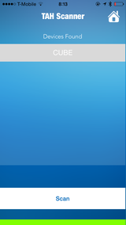

### Tah Dice
Create an accessory for your smartphone to play more immersive games
using a physical dice which you can actually throw around.  
This repository consists of the iOS and Android(coming soon) source
code along with the corresponding Arduino sketch for the Tah Dice
app.  

    

---

## Usage

#### Arduino
* Install the
[Tah Arduino Library](https://github.com/tah-io/Tah_Arduino_Library#installing)
* Download the
[Cube](https://raw.githubusercontent.com/tah-io/Tah-Dice/master/Dice/Dice.ino)
and open it in the Arduino IDE
* Upload it on your Tah board

#### iOS
* Clone the repo

		git clone https://github.com/tah-io/Tah-Dice.git

* Change directory to the appropriate submodule (iOS or Android)

		cd Tah-iOS

* Initialize and update the submodule

		git submodule init
		git submodule update
* Open the Xcode project file TAH Dice.xcodeproj 
